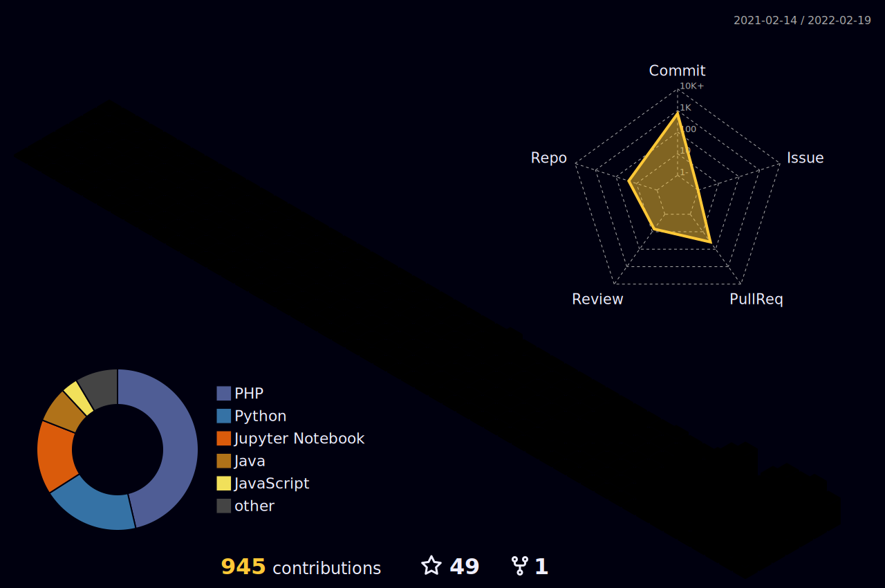

<h1 align="center"> I'm a

        </h1>

 

    
    <h4>
    🌱 I’m mostly interested in:
    
         
    👯 I’m looking to collaborate on:
    
         
    💬 Talk to me all about:
    
    </h4>

<h2 align="center">Languages and Tools:</h2>

    
     
     
     
    
    
    
    
    
    
     

 
<h2></h2>

    
    
    
    
    
    

        
        
        <a href="https://www.linkedin.com/in/sabyasachi-seal-4461711bb/">
            
    <!--</a>
        -->
        
        

<h2 align="center">My Stats:</h2>

 

    
    <a href="https://github.com/Sabyasachi-Seal">
        
         
    </a>

<h2></h2>

    

<h2></h2>

<!--   

    

-->

<h2></h2>

    
    

<h2 align="center">Wanna Talk?</h2>

            

<!--https://raw.githubusercontent.com/Sabyasachi-Seal/Sabyasachi-Seal/ouput/github-snake.svg-->
            

